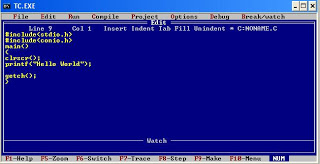

## To FB or not to FB...

That is the question many Facebook users have been asking themselves since the Russia-Facebook scandal became known.  It is not an easy question for most people as they grapple with the ethics of the situation.  Perhaps it would be helpful to look at from a Software Engineering point of view.

 

## What does Ethics in Software Engineering mean? 

Ethics in Software Engineering(SE) is really not far from ethics in other areas of life.  One of the main concepts that drives the SE ethical code is to do things for the good of the public.  Another is to "avoid harm."  These seem rather obvious and one would hope that most people try to live by these in their daily lives.

One of thing that sets the SE code apart from daily life is that it puts a lot of responsibility on Software Engineers and Computer Scientists to not be bystanders.  It is not enough to avoid the immediate harm you can see, you need to look further down the road and **imagine** all the possibilities and scenarios where harm could occur and do your best to avoid those as well.  

> "That was my prize mistake. A failure of imagination."
> > --Olenna Tyrell

## How does this relate to the Facebook scandal?

## So what should I do?

