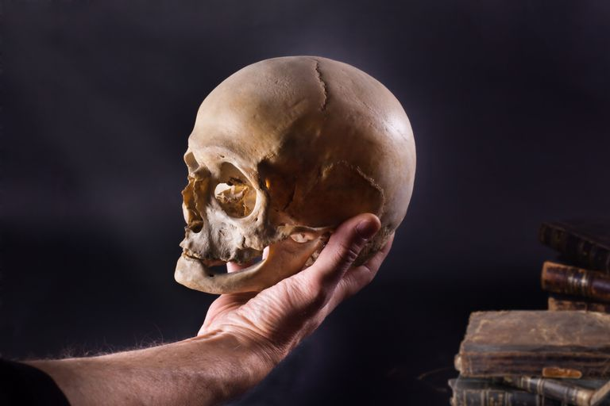
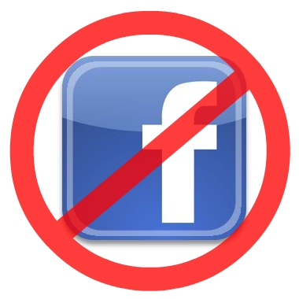
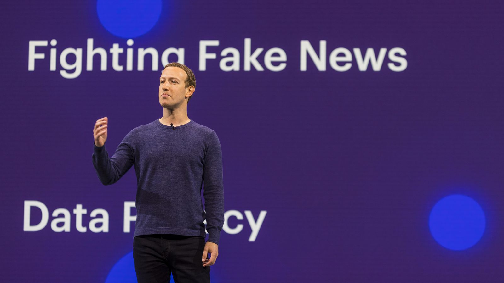
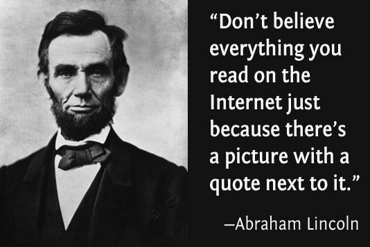

That is the question many Facebook users have been asking themselves since the Russia-Facebook scandal became known.  It is not an easy question for most people as they grapple with the ethics of the situation.  Perhaps it would be helpful to look at from a Software Engineering point of view.

 

## What does Ethics in Software Engineering mean? 

Ethics in Software Engineering(SE) is really not far from ethics in other areas of life.  One of the main concepts that drives the SE ethical code is to do things for the good of the public.  Another is to "avoid harm."  These seem rather obvious and one would hope that most people try to live by these in their daily lives.

However, one of things that sets the SE code apart from "daily life ethics" is that it puts a lot more responsibility on Software Engineers and Computer Scientists to not be bystanders.  It is not enough to avoid the immediate harm you can see, you need to look further down the road and <b>imagine</b> all the possibilities and scenarios where harm could occur and do your best to avoid those as well.  

> "That was my prize mistake. A failure of imagination."
> > --Olenna Tyrell

Software Engineers should actively be evaluating the consequences of their code, both immediate and future.  

The second biggest responsibility of a Software Engineer, in my opinion, is to educate their users about their technology.  It is important that the consumer understands both the capabilities and limitations of the software so they can make educated decisions when using the software.  Educating the general public was really important to our founding fathers and this part of the SE ethics code really helps to support and embody that notion.

## How does this relate to the Facebook scandal?

It is probably quite obvious by now that Facebook leaders made some very unethical decisions when it came to the scandal with the Russian fake news and selling their user's data.  1) They did not act in the best interest of the public. 2) They caused harm. 3) They did not properly educate people about their product.  It is very easy to point fingers and find fault in the things they did.  It is also not difficult to make a compelling case for you to delete your Facebook account.  After all, who would want to support such monsters?  

But that is not what I am going to discuss here.  Instead, I'd like to look at it from a different, possibly more interesting, point of view.  I would like to instead explore how we have an ethical responsibility to continue to support Facebook.

## Do you believe in second chances?

While it is definitely true that Facebook was unsucessful in avoiding harm, the second half of that principle is that if you do commit harm, FIX it.  We need to give Facebook the chance to fix the harm they've caused to the best of their ability.  This also ties into the ACM Code of Ethics Principle 3.7:

> > "Recognize and take special care of systems that become integrated into the infrastructure of society."

Like it or not, Facebook has indeed become integrated into our society.  It would not be right to just throw something as huge as this away the second it breaks.  Instead, we should put effor into improving upon it.  We should also consider that there is a huge team of people who make up Facebook, not just the leaders who made all those terrible decisions.  That team of people created something amazing.  We should acknowledge these efforts by giving them a chance to continue working on their creation.  Instead of tossing them aside, we should hold them (and all social media platforms) to a higher standard.  Give them a chance to rise to our expectations.

Many people criticize people Facebook for allowing themselves to be hacked, but the reality of the situation is that no one WANTS to be hacked.  Do you blame the victims of identity theft?  Could Facebook have taken more preventative measures?  Probably, but that's in the past and hindsight is 20-20.  The issue now is trying to make the necessary advancements in cyber-security to keep out these hackers.  It's true that other sites may not get hacked as often, but it's not necessarily because they're better.  Facebook is a huge target for some of the best hackers in the world.  They have to deal with things that smaller companies probably haven't even contemplated.  If we get rid of Facebook just because they got hacked, the hackers won't go away. They will simply move on to another target and that new target will have to deal with these issues.  Instead, I propose that we be proactive and push Facebook to come up with innovative solutions to combat hacking.  This will hopefully compell other companies to do the same, which will be good for technology as a whole.  In fact, you could also say it would be in the best interest of public. 

## So what should I do?

Ultimately, the decision is yours to make.  Look at the facts, consider both sides of the situation and make a decision that feels ethically correct to YOU.  Because at the end of the day, you have to live with yourself.  Personally, I will be keeping my account because for me, the pros outweigh the cons. I will in turn try to be a responsible consumer by being cautious with my personal data and always reading things with a grain of salt.

