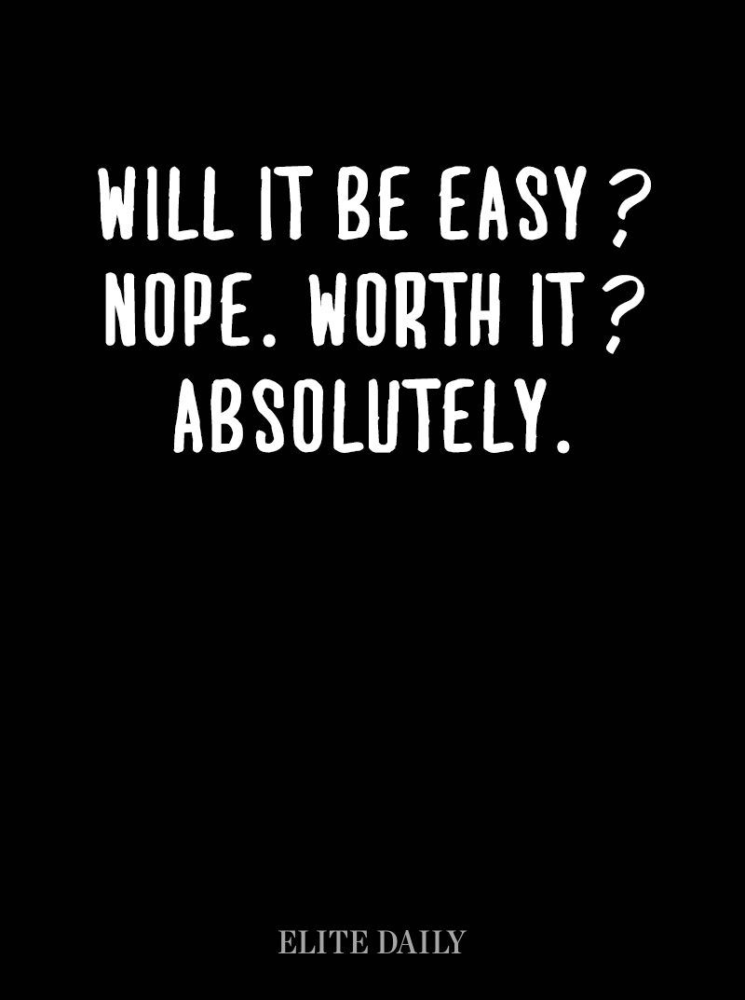

## Step 1: Just Breathe...

I have officially finished my second week of Software Engineering and my head is spinning.  A couple days into the first week I realized that my planner is not only a pleasantry, but a necessity if I am going to survive this semester.  After a short bout of anxiety, I filled in a couple weeks of my schedule, made a few to do lists, took a deep breathe, and realized that this was going to be FUN.  I'm one of those weird people who thrive off of a busy schedule, high pressure situations and anxiety.

## Step 2: Javascript isn't Java???

Javascript is officially the second programming language I am learning. Up until now I can really only claim proficiency in Java.  Much to my surprise, they are completely different languages, just with similar names.  I'm not sure why the creators did that, but it is quite confusing for the general public.  Luckily though, they have very similar syntax, which is making the learning process fairly smooth.  One thing that is quite different from Java is the declaration of variables without specifying the type.  This is a bit strange for me and I haven't decided if I like it or not.  On the one hand, I enjoy the flexibility, but in the long run I'm not sure what the repercussions will be for having so much flexibility.

## Step 3: Work that Brain

> "Life begins at the end of your comfort zone."
> -Neale Donald Walsch

I have always enjoyed giving my brain a good workout and I sincerely believe mental workouts can make you just as exhausted as physical one.  Dr. Johnson seems to have also embraced this principle with his brain workouts of the day or WODs.  I, for one, am very excited for these and hope they will provide ample practice for interviews in the future.  Our practice WODs so far seem to be a good gauge of the “real deal” in class, which is very helpful.  It is comforting to know where you stand at least a little bit before heading into class.  The bWOD from our TA, Brandon, was a bit more challenging than the other practices, but definitely creative and good practice.  After all, you don’t get stronger by only lifting light weights.

## To Sum It Up
Bring it on!  It’s going to be a fun semester.

