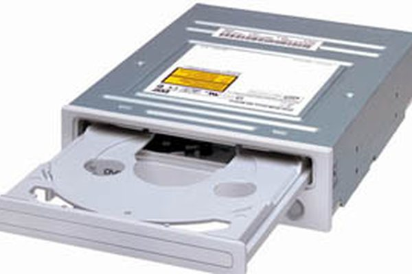

## Once upon a time...

In Kindergarten I won a $500 prize at school.  Most kids would use it on toys or clothes, or their parents would put it into savings for them, but not me.  I wanted a CD-rom drive for our computer at home (it was 1994, they were still pretty new) and math computer games.  I'd like to say, "from then on the rest is history," but my path to Computer Science was not so straight forward.  

## Fast Forward
I have always enjoyed puzzles.  My favorite classes in school were the ones that made me think.  I preferred critical thinking and creativity over brute force memorization by repetition.  I later came to realize the latter was, of course, a necessity, but children are stubborn and I was no exception. 
By the time I was a sophomore in college, I realized that math was not as cut and dry as people made it seem.  In fact, it perfectly combined my love for puzzles and creativity.  Anyone who says math does not require creativity has never tried to solve a multi-page proof.  My general approach was to go forwards, backwards, and sometimes inside out until I could connect my "Given" statement to my final "Therefore."  But what to do with a degree in Math?

Like many undergraduate Math majors, and much to my dismay, I found myself teaching high school math.  This brought on a whole new set of problems and definitely required a lot of creativity, but at the end of the day I never felt satisfied.  I have all the respect in the world for teachers who love what they do, but for me, something was still missing.  I felt my brain muscles slowly becoming complacent as they were no longer required to do the same type of "heavy lifting" they did in college.  One summer, I took a class for teachers in programming Altino cars using Arduino boards and was instantly hooked.  I was already wanting to go back to school for my Master's Degree, so why not do it in Computer Science?  I realized that similarly to math, it was the perfect mix of puzzles and creativity for me.  So 24 years later, that little girl who wanted to spend all her money on the newest computer tech finally entered graduate school at the University of Hawai'i for Computer Science.

## Present Day

While in school, I hope to become a "well rounded computer scientist."  I want to improve my overall skills as a programmer and learn to work on large software projects in a team.  I want to learn about everything from Machine Learning to Networking to Operating Systems.  I hope to contribute to some Open-Source code and get a few internships that will help me gain experience to enter the workforce after I graduate.  I am so excited to be back in school, I just want to absorb as much as I can before embarking on the next chapter of my life. 

