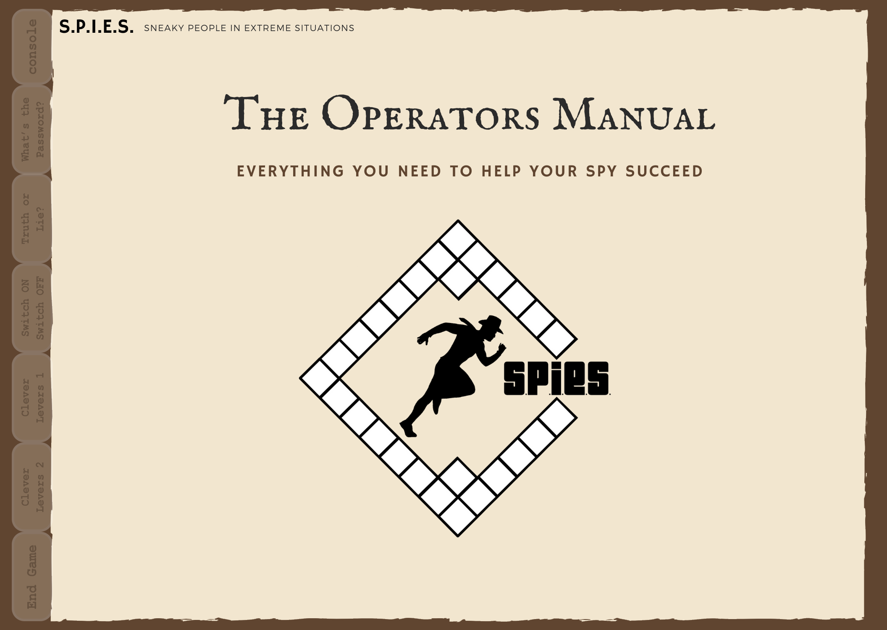
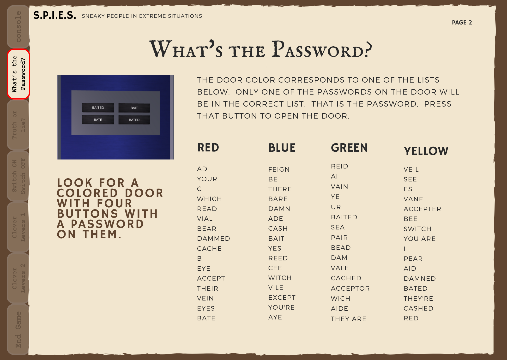
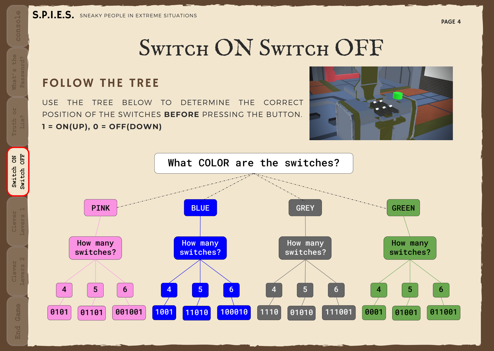
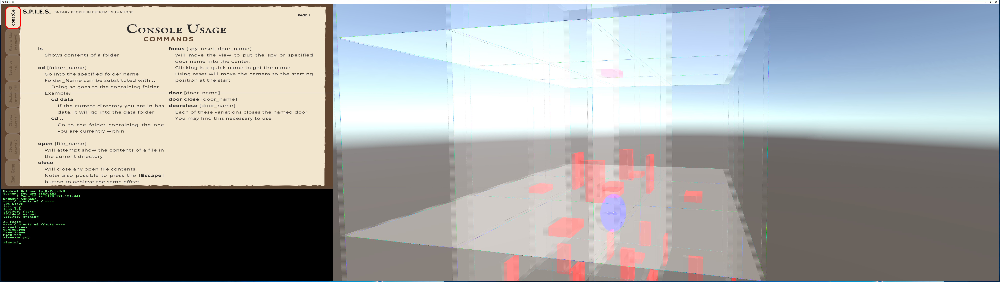

## Overview
 

## My Responsibilities

  <
   
   

*Admin page displaying all foods added to site as well as foods added by each user.*

## Reflection

## Want to know more?

[SPIES Final Project Presentation Slides](../files/SPIES-presentation.pdf "Project Presentation PDF")

<a href="https://github.com/hangryfix/hangryfix"><button>Source Code</button></a>

