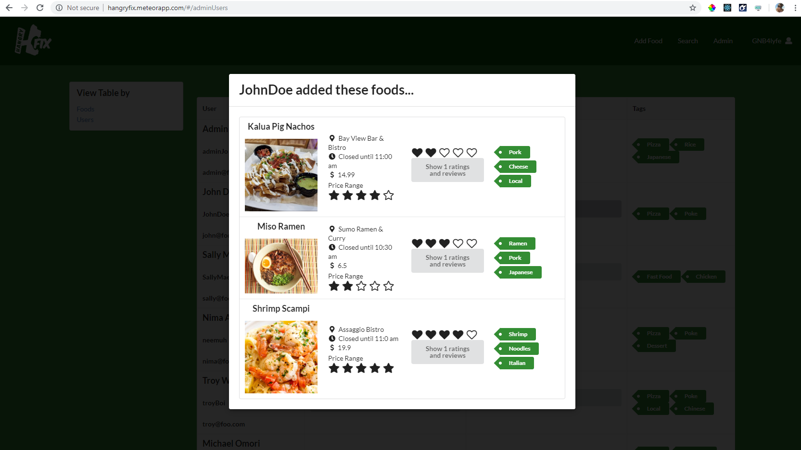

## Overview
 
As the final project for Software Engineering, we were tasked to create a Web App that would benefit our campus(UH Manoa) in some way.  We chose to create an app called hangryFIX that is similar to Yelp, but is focused on the actual food items, rather than restaurants since that is generally more important when you are really hungry.  I worked on a team of 3 and we used GitHub to manage and code our project.  The app itself is a Meteor app and we used React Semantic UI as a tool to write it.

## My Responsibilities

My main contributions to the project were the Landing, Sign-up, and Admin pages, as well as user testing once we were close to completion.

The Landing page was the most fun to create because that is the first thing people see when they visit our site.  We decided upon the general layout as a group, but I got to implement everything, choose the pictures, create the write ups, etc.

The Admin page was the most interesting to create because I had to think about what types of things a site admin might want to access.  I had to dynamically pull data from almost all our collections and put them into something worthwhile.  This was also the most challenging to add functionality to.  I had to be creative in the way I was filtering the data from the collections, but I enjoyed the challenge and it was very satisfying to see it work in the end.

  <
   

*Admin page displaying all foods added to site as well as foods added by each user.*

## Reflection
Overall, this is probably one of the better experiences I've had working on a team.  The three of us had a really good group dynamic.  No one was over zealous or lazy, everyone just wanted to put out a good product.  Work got done, communication was always open, and we had a lot of fun.  I feel very fortunate because I know this is not always the case when placed into groups for software development.  

The thing that took us the most getting used to was to actually use the project boards on GitHub.  But in the end it became more natural and actually ended up saving us a great deal of time because I could easily locate a previous branch I needed to pull code from at the last minute.

By the end of the project I think I definitely grew a lot stronger as a developer through lots of trial and error with different React elements.  I was thrilled with the positive feedback we got from our user testing and I am excited to try out my new skills in the months/years to come.

## Want to know more?

<a href="http://hangryfix.meteorapp.com/#/"><button>Go to Deployed App</button></a>
 
 

<a href="https://hangryfix.github.io/"><button>GitHub Project Page</button></a>
 
 

<a href="https://github.com/hangryfix/hangryfix"><button>Source Code</button></a>

