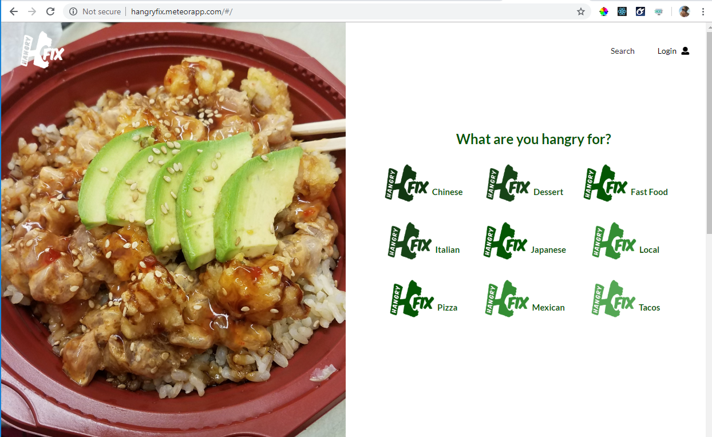
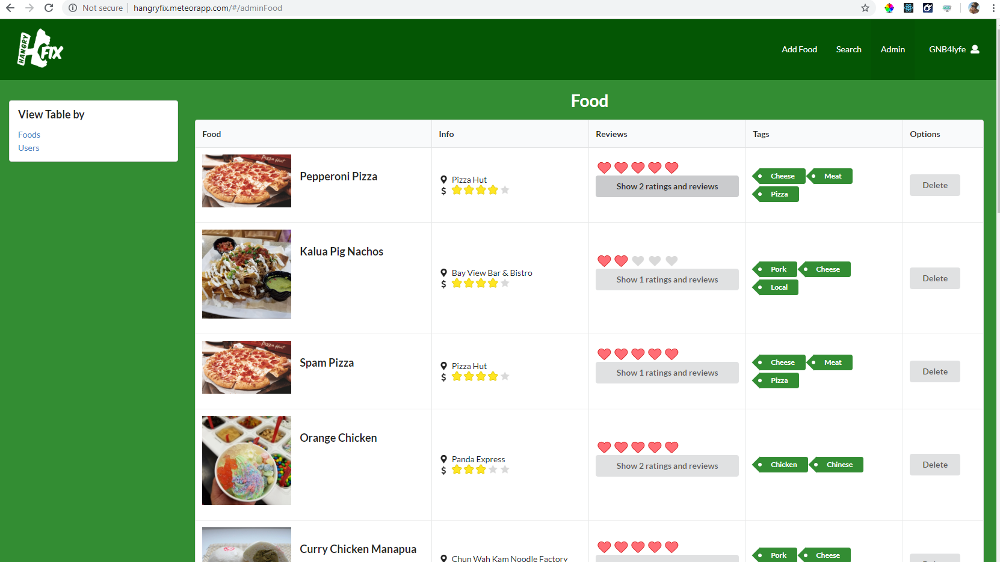

  

## Overview

As the final project for Software Engineering, we were tasked to create a Web App that would benefit our campus(UH Manoa) in some way.  We chose to create an app called hangryFIX that is similar to Yelp, but is focused on the actual food items, rather than restaurants since that is generally more important when you are really hungry.  I worked on a team of 3 and we used GitHub to manage and code our project.  The app itself is a Meteor app and we used React Semantic UI as a tool to write it.

## My Responsibilities

My main contributions to the project were the Landing, Sign-up, and Admin pages, as well as user testing once we were close to completion.

The Landing page was the most fun to create because that is the first thing people see when they visit our site.  We decided upon the general layout as a group, but I got to implement everything, choose the pictures, create the write ups, etc.

The Admin page was the most interesting to create because I had to think about what types of things a site admin might want to access.  I had to dynamically pull data from almost all our collections and put them into something worthwhile.  This was also the most challenging to add functionality to, but definitely taught me a lot about filtering and props.

*Admin page displaying all foods added to site.*

## Reflection

This was one of the more complicated pieces of code I wrote for this class, even though it is actually fairly simple.  I enjoyed having a little more freedom in the implementation than other projects in the class.  For example, adding the extra check in the code above to improve the runtime.  It required a decent amount of thought to get the logic just right and I enjoyed the challenge.  An important lesson I learned during this project was that sometimes you just need to walk away from your code for a little while to get some perspective.  And consequently, always start early so you have time to walk away.

[Link to Main Code](../files/SudokuSolver-main.pdf "Sudoku Solver- Main PDF")

