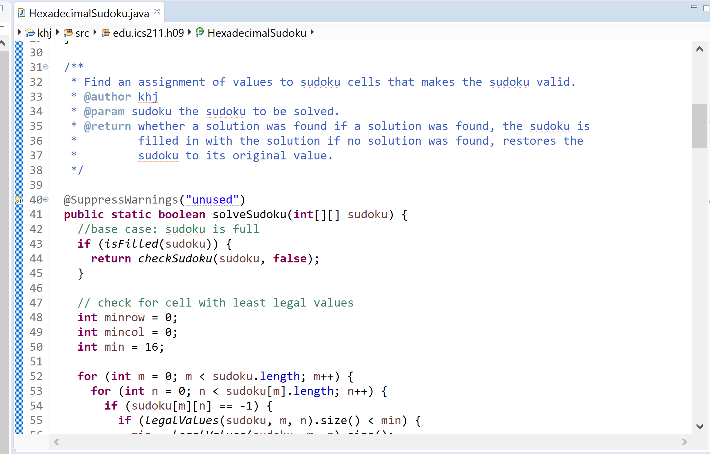

<div class="ui small rounded images">
  
</div>

## Overview

In ICS 211 (Intro to Computer Science II) we were charged with coming up with a recursive Hexadecimal sudoku solver algorithm.  This is definitely not the most efficient algorithm as it had an exponential runtime, but the exercise was in recursion.  Regular Sudoku is a 9 x 9 square puzzle where every row, column, and inner 3x3 square must contain the values 1-9 exactly once.  It starts out partially filled and the player uses logic to fill the remaining squares.  Hexadecimal sudoku also adds in the letters A-F, making it a 16 x 16 puzzle with 4 x 4 inner squares.

## The Algorithm

The algorithm I created started at the first empty cell and checked what values were still legal by eliminating the values already filled in it's column, row, and 4 x 4 square.  
Next, it filled that empty cell with the first available legal value, then continued to the next empty cell.
If the algorithm reached a cell that had no legal values, that meant one of the former values was incorrect, so it backtracked to the most recently filled cell and tried the next legal value instead.
It continued to do this until all the cells were filled, then it would return the completed puzzle.  Or, if it exhausted all possible values and did not come up with a solution, it would return "Not Solvable."

Once important tweak I made to speed up runtime was to first check all empty cells and choose the one with the LEAST valid values and fill that one first.  It repeated this everytime it chose a cell to fill.  This check is a small price to pay compared to the overall runtime and greatly reduces the amount of backtracking required by the algorithms, therefore speeding up the overall time.

## Sample Code

```js
 // check for cell with least legal values
    int minrow = 0;
    int mincol = 0;
    int min = 16;

    for (int m = 0; m < sudoku.length; m++) {
      for (int n = 0; n < sudoku[m].length; n++) {
        if (sudoku[m][n] == -1) {
          if (legalValues(sudoku, m, n).size() < min) {
            min = legalValues(sudoku, m, n).size();
            minrow = m;
            mincol = n;
          }
        }
      }
    }
```

## Reflection

This was one of the more complicated pieces of code I wrote for this class, even though it is actually fairly simple.  I enjoyed having a little more freedom in the implementation than other projects in the class.  For example, adding the extra check in the code above to improve the runtime.  It required a decent amount of thought to get the logic just right and I enjoyed the challenge.


[Link to Main Code](../SudokuSolver-Test.pdf "Sudoku Solver- Main PDF")


