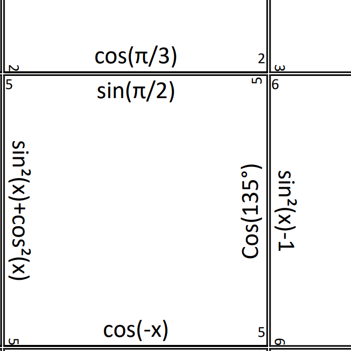
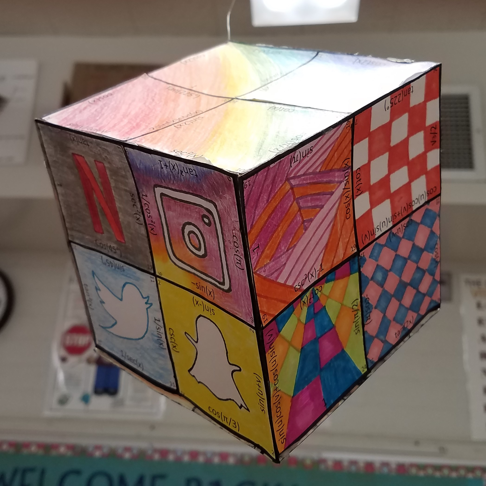
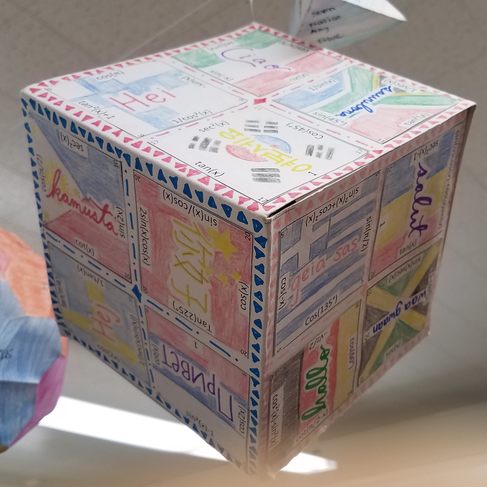

## Premise

I did part of my student teaching in a Trigonometry class and was tasked with designing a project for them.  Since I like puzzles, I thought it would be fun to create a puzzle cube to help them practice their Trig identities and of course, logic.

## How it works

Students are given 24 squares with a Trig identity expression on each side of the square.  They must create a cube (4 squares on each face) such that the expression on each edge of a square must be equivalent to the expression on the edge of the square it is touching.  There are many different equivalent expressions for any given Trig identity, but only one combination that correctly makes the cube, that's where the logic comes in.
Students are encouraged to work in pairs and are given about 1-2 weeks to complete outside of class.
When they have successfully created the cube, they are then encouraged to color and decorate it so it can be displayed in class.

  
  
  

*Finished Trig Cube Projects

## Reflection
This is one of the first projects I created myself from scratch and I really enjoyed it.  Based on student feedback, it definitely challenged them, but also helped them to learn their Trig identities better.

[Trig Cube Project Rubric](../files/trig-cube-rubric.pdf "Project PDF")

[Trig Cube Project Squares](../files/trig-cube-squares.pdf "Project PDF")
